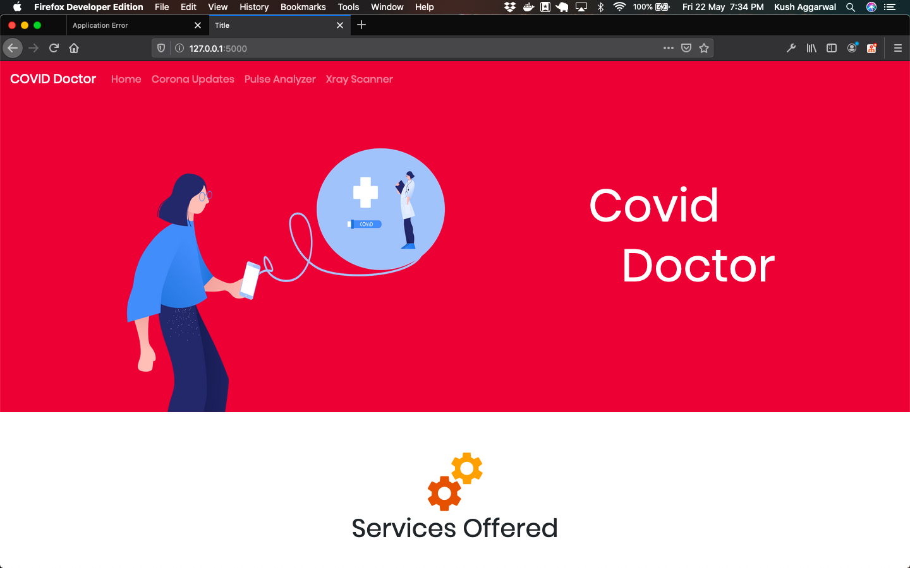
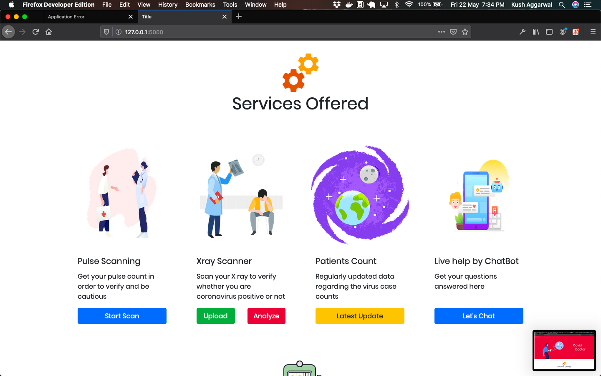
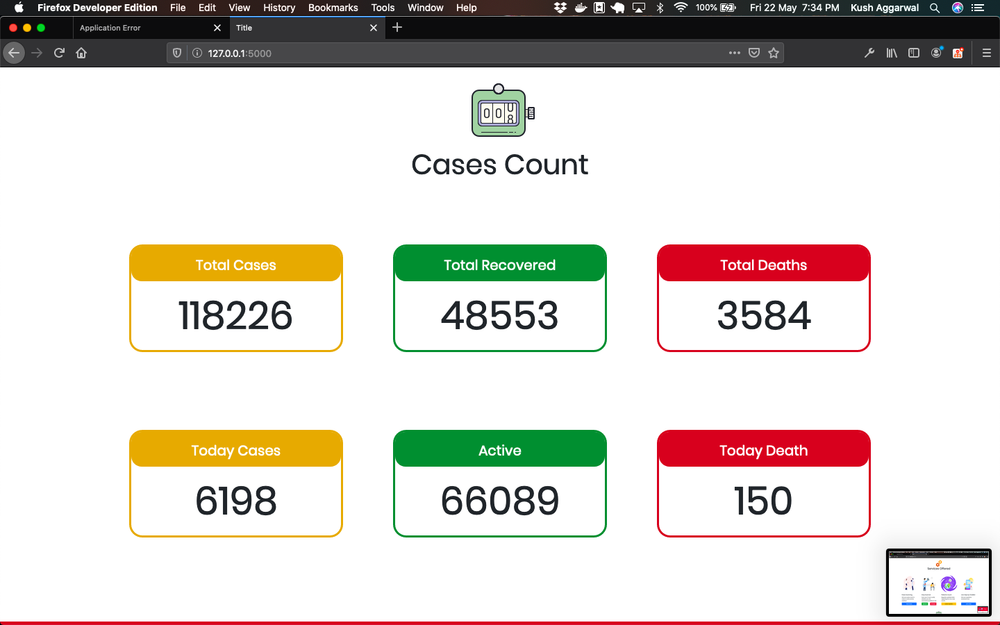
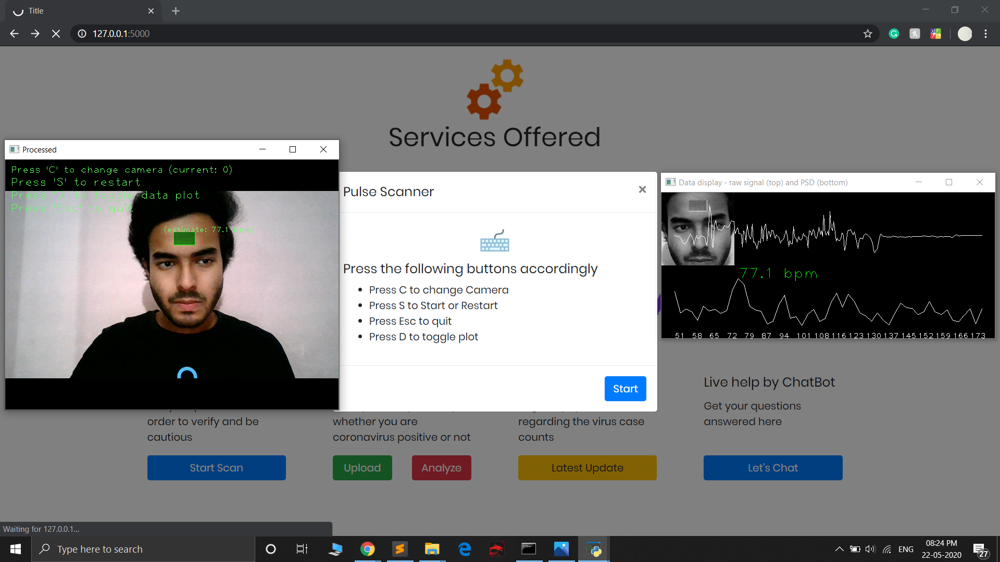
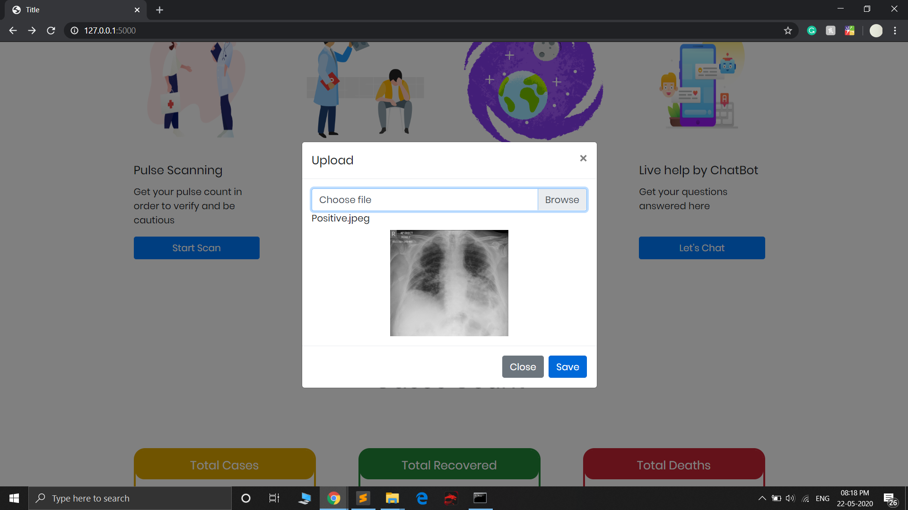
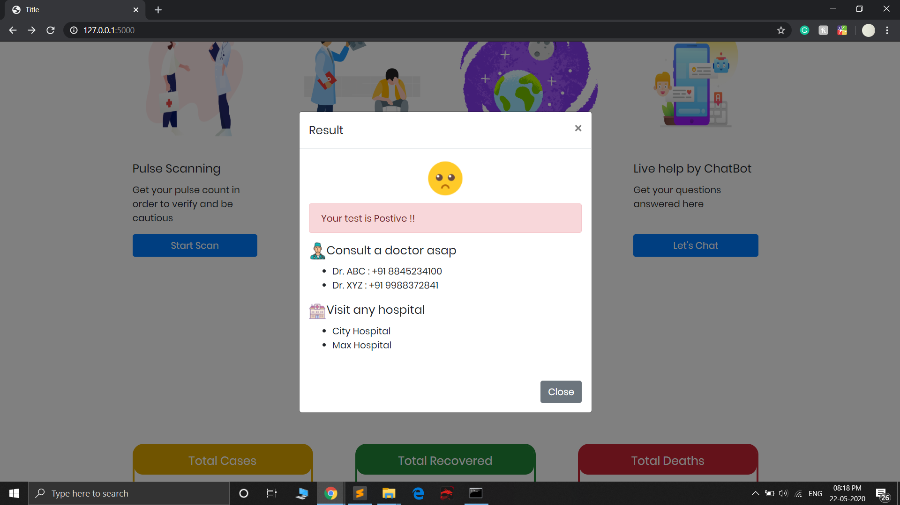
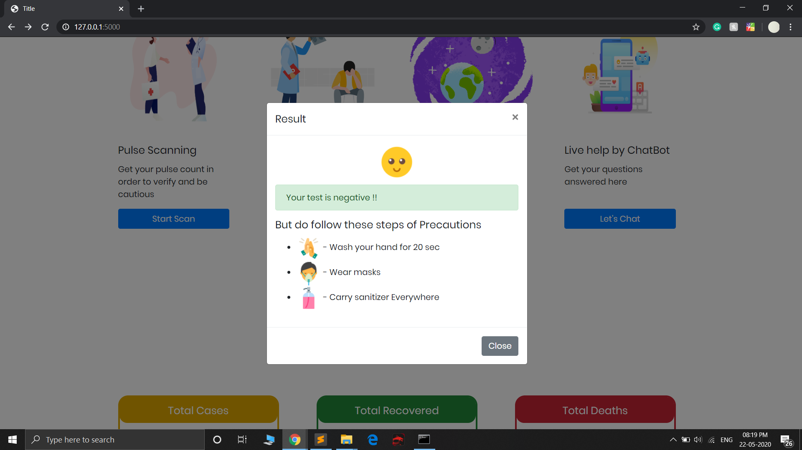
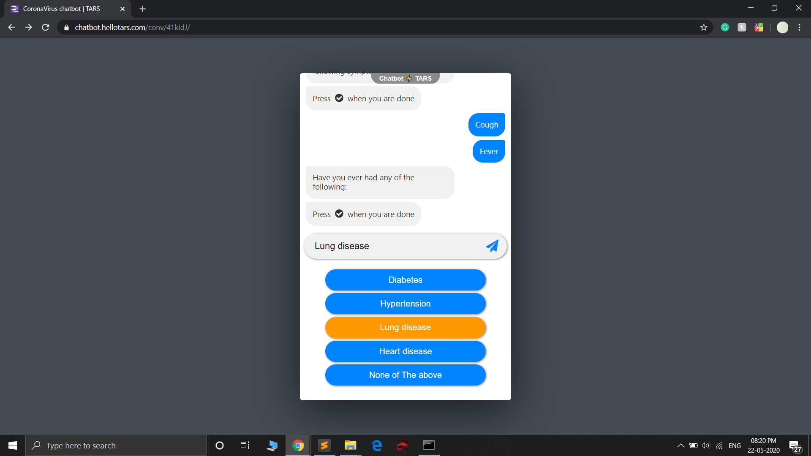
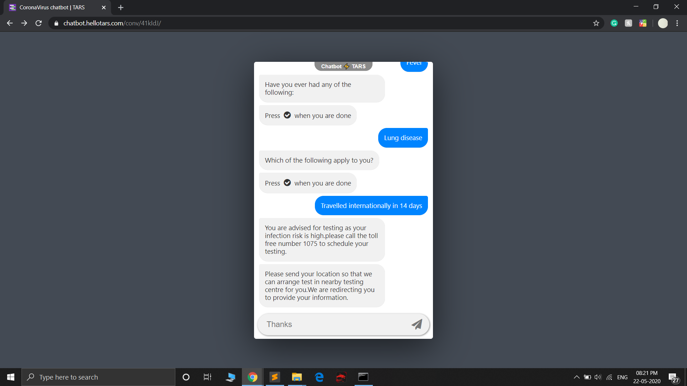

# Covid Doctor

This project is an automated covid-19 doctor helping in identifying the cases via

- Real Time Pulse Scanning
- X-Ray Classification
- Live Covid 19 Stats
- Real Time Self Assessment Chatbot

### Objective

In the current scenario, there is a widespread of coronavirus in the entire world, but there are limited supplies and services for the patients. But there are a large number of people who want to take Covid test to assure that they are safe, so they went to hospitals and an unnecessary crowd gathers there, which has a high chance of spreading coronavirus. So, to stop this, Team Neurons has developed a contactless Covid 19 Detection Webapp Covid Doctor, which predicts the vital information of humans using a simple camera and a browser. So, people can take the self-assessment test and can run the health test to ensure that they are safe and won’t go to the hospital, which has a high chance of catching the virus.

### Motivation

In these difficult times everybody has to be causious for which they need to have a self assesment tool which they can use for scanning themselves anytime.

### Services Offered By Covid Doctor

<b>1. Real time Pulse Detection - </b>Pulse detection plays a vital role in the detection of Covid. Respiratory rate is the number of breaths (inhales and exhales) you take in a minute and ranges from 12-20 breaths in a healthy person. Resting heart rate is the number of times your heart beats per minute and ranges between 60-90 in a healthy person, and heart rate variability is the time in between each heart beat. So the change in pulse rate will help in early detection of Covid 19 and this can be tracked using just a camera and a browser. 

<b>2. Covid X-Ray Classification - </b> With the help of this feature we can get immediate result of our X-Ray instead of going to the hospital and waiting for the outcome, which can lead to the spread of the deadly virus. So, using Deep Learning technology we have built a X-ray Classifier which classifies whether the patient is COVID Positive or Negative. This is will save time and stops from spreading of virus.

<b>3. Live Covid 19 Stats - </b> People can monitor the live stats of Coronavirus Confirmed, Active, Recovered cases, etc. in one place.

<b>4. Real-Time Self Assessment Chatbot - </b> People can do take their self-assessment checkup by answering the few questions and based on that answers, the user will get the advice by the chatbot such as to quarantine or visit the hospital or precautions if the user is healthy. This will help people in ensuring their safety.

### Screenshot

### Tech Stack

- Python 3
- Open CV for image detection
- Tensorflow and Keras for deep learning
- Machine learning for pulse scanning models
- Flask for web deployment
- HTML and CSS for web frontend

### Team Members

1. <a href="https://www.linkedin.com/in/ankur-verma-0bb747154/">Ankur Vemra</a>
2. <a href="https://www.linkedin.com/in/kush-aggarwal-1b236717b/">Kush Aggarwal</a>
3. <a href="https://www.linkedin.com/in/nitish-kumar-70ba97163/">Nitish Kumar</a>
4. <a href="https://www.linkedin.com/in/shubham-goel-ml/">Shubham Goel</a>

