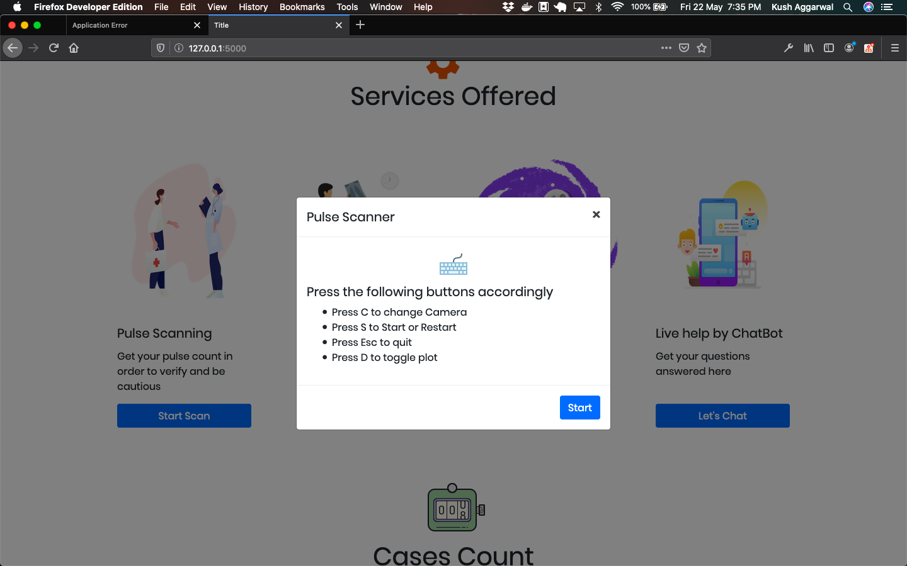
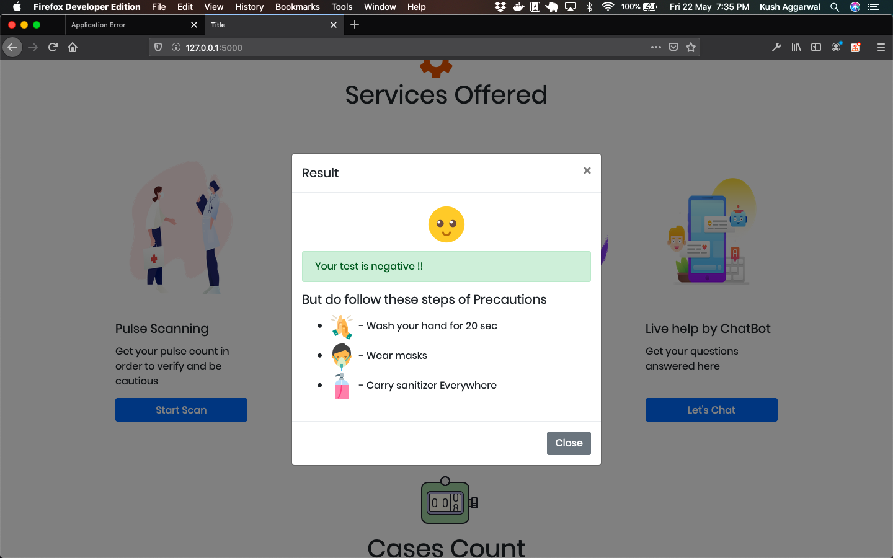

# Covid Doctor

This project is an automated covid-19 doctor helping in identifying the cases via

- Pulse Scanning
- Xray Scanning

### Motivation

In these difficult times everybody has to be causious for which they need to have a self assesment tool which they can use for scanning themselves anytime

### Screenshot

### Tech Stack

- Open CV for image detection
- Keras for deep learning
- Flask for web deployment
- Machine learning for pulse scanning models

### Services Offered By Covid Doctor

- Pulse Scanning
- Xray Scanning
- Real time COVID Updates
- Chatbot for real time assistance
